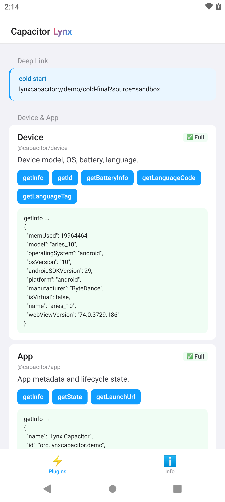
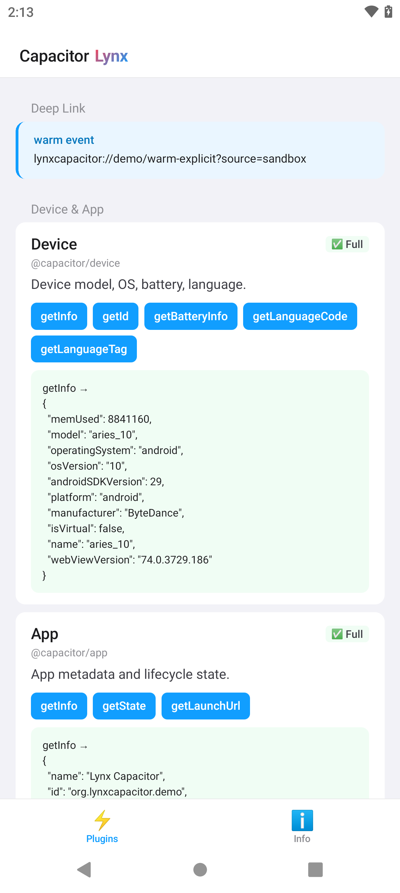
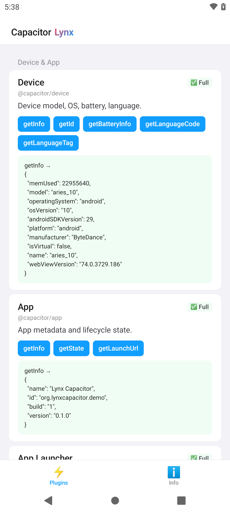
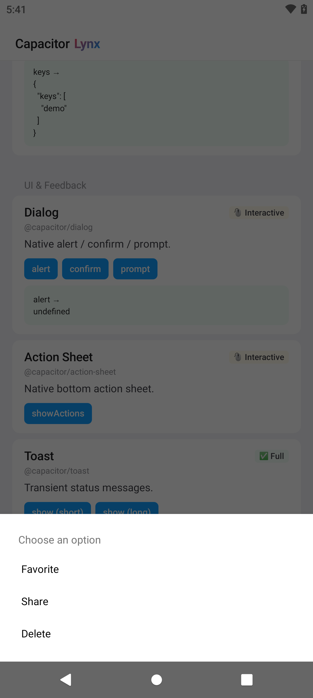
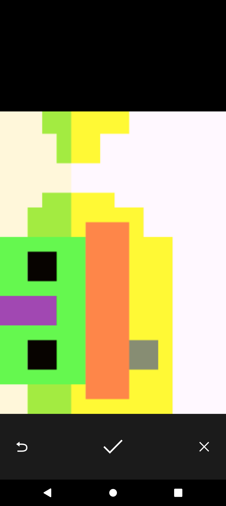
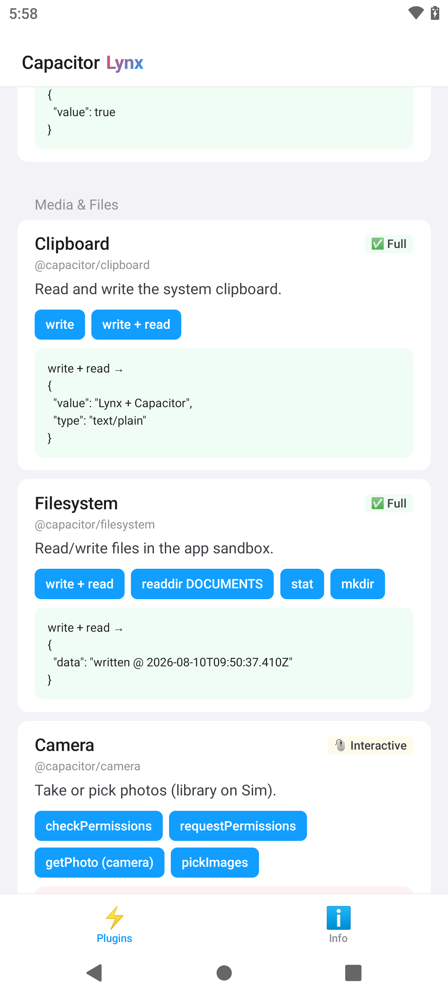
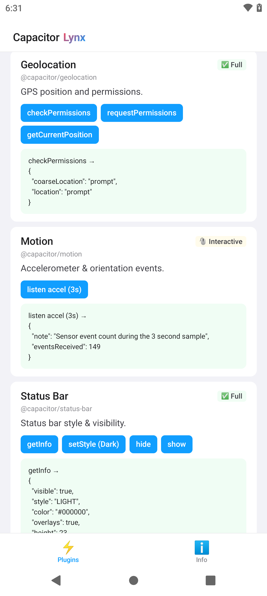

# Android verification

Verified on 2026-08-10 with Lynx Sandbox cloud devices:

- Device: `aries_10`, Android 10 / API 29, reported as a physical device
- Headless bridge after adding Calendar and Contacts: `LC_BRIDGE_READY plugins=38 webView=false`
- Original automatic matrix: `LC_SMOKE_DONE passed=29 failed=0 total=29`
- Calendar follow-up: `LC_SMOKE PASS Calendar.create + find + delete`
- Contacts follow-up: `LC_SMOKE PASS Contacts.create + find + delete`
- Bundle embedded in the APK is byte-identical to `demo/dist/main.lynx.bundle`
- Follow-up APK SHA-256: `29149e6e8e055eba09f760bf88340183a7ba8048fe3b189b2ef4e027e53ffc94`
- Follow-up bundle SHA-256: `38f1f48c61d56b5a7389e43ff5481ed7725e1657938991c10694caa70da6c016`

The bridge host never constructs a WebView. `InAppBrowser.openInWebView` creates
its own plugin-owned Activity only when that action is explicitly requested.

The automatic result counts actions, not distinct plugins. The 29 actions cover
28 gallery entries: 25 official Capacitor plugins and 3 Community plugins
(`Keep Awake` contributes two actions). It should not be read as "29 official
plugins verified end to end."

## Calendar and Contacts follow-up

Both newly added plugins were tested through the same Lynx-to-Capacitor native
bridge used by the gallery. Runtime permissions were granted on the sandbox
device before the non-interactive test run.

| Plugin | Native operations | Result |
|---|---|---|
| Calendar | `createCalendar` → `createEvent` → `findEvents` → `deleteEvent` → `deleteCalendar` | All five calls returned `success=true`; smoke passed |
| Contacts | `save` → `find` by returned id → `remove` | All three calls returned `success=true`; smoke passed |

The follow-up app mount ran 31 automatic actions. Calendar and Contacts passed;
the result was `30 passed / 1 failed` because the existing File Transfer network
download timed out after 12 seconds on that run. This timeout is unrelated to
the two targeted provider-backed CRUD checks and does not replace the earlier
29/29 baseline.

## Exit-criteria calls

| Call | Device evidence |
|---|---|
| `Device.getInfo()` | Success; Android 10, API 29, model `aries_10` |
| `Preferences.set/get()` | Success in the automatic matrix |
| `Filesystem.writeFile/readFile()` | Success with data round-trip |
| `Camera.getPhoto()` | `IMAGE_CAPTURE` with a FileProvider URI, photo confirmed, `success=true` |
| `ActionSheet.showActions()` | Native bottom sheet shown and selection returned |

## Interactive coverage

| Plugin | Result |
|---|---|
| Dialog | Native alert shown and dismissed |
| Action Sheet | Native sheet shown; selection returned successfully |
| Share | Android `CHOOSER` Activity shown; cancellation returned to Lynx |
| Camera | Native camera captured and returned a photo successfully |
| File Viewer | Local file opened through an Android `VIEW` resolver; `success=true` |
| Browser | Android browser Activity opened; `Browser.open success=true` |
| InAppBrowser | Plugin-owned `OSIABWebViewActivity` opened; `success=true` |
| Motion | 149 accelerometer events received in 3 seconds; listener then stopped |

These are all eight entries classified as interactive in the Android gallery.
They were exercised manually in addition to the automatic matrix.

## Partial and configuration-gated coverage

The following integrated entries are not claimed as end-to-end verified:

- Background Runner needs a registered JS runner.
- Barcode Scanner still needs an actual barcode scan workflow.
- Google Maps needs its native SDK and an API key.
- Keyboard has methods coupled to a WebView-backed host.
- Local LLM passed only `systemAvailability`; model warmup/inference was not run.
- Push Notifications passed only the permission probe; FCM registration and
  message delivery were not configured.

The Motion check is also evidence for retained Capacitor callbacks: Android
results travel through Lynx `GlobalEventEmitter`, because a Lynx NativeModule
`Callback` is intentionally one-shot.

## Deep Link lifecycle

Reverified on 2026-08-16 on the same `aries_10` / Android 10 class of Lynx
Sandbox cloud device. Both paths used the installed `@capacitor/app` package;
the demo did not parse the Activity Intent directly in JavaScript.

| App state | Native entry | JavaScript evidence |
|---|---|---|
| Cold process start | Bridge captured the Activity's launch Intent | `App.getLaunchUrl()` returned `lynxcapacitor://demo/cold-final?source=sandbox` |
| Warm, running Activity | `MainActivity.onNewIntent` → `LynxCapacitorRuntime.onNewIntent` | `appUrlOpen` emitted `lynxcapacitor://demo/warm-explicit?source=sandbox` |

The warm case retained the existing Activity (`Activity not started, intent has
been delivered to currently running top-most instance`) and logged both the
native handoff and the Lynx callback:

```text
LC_DEEP_LINK android url=lynxcapacitor://demo/warm-explicit?source=sandbox
LC_DEEP_LINK source=warm event url=lynxcapacitor://demo/warm-explicit?source=sandbox
```

Run `scripts/verify-deep-links-android.sh <adb-serial>` after building the APK
to repeat both assertions.

## Screenshots

### Deep Link cold and warm lifecycle





### Device and smoke results



### Native Action Sheet



### Camera capture confirmation and return





### Persistent Motion listener


